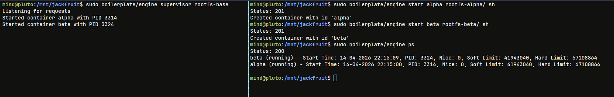
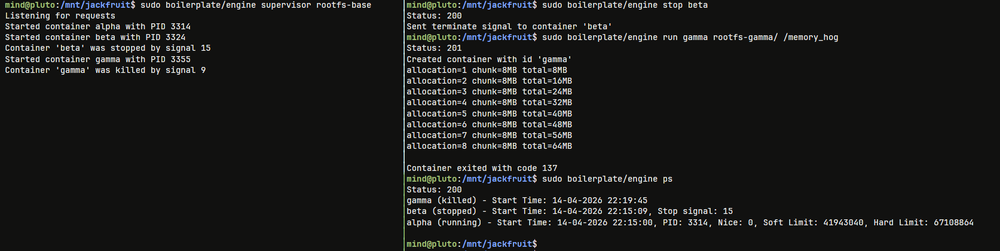
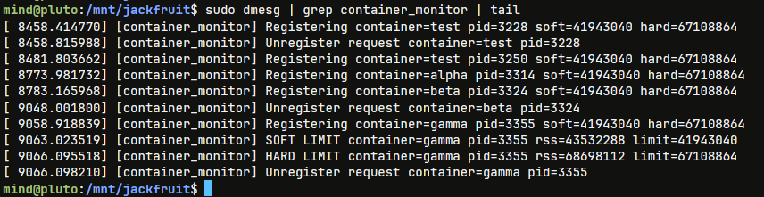
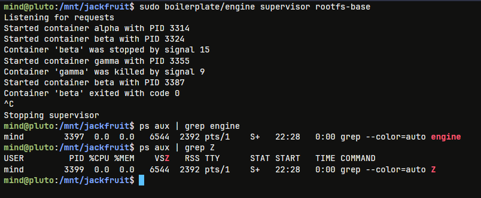
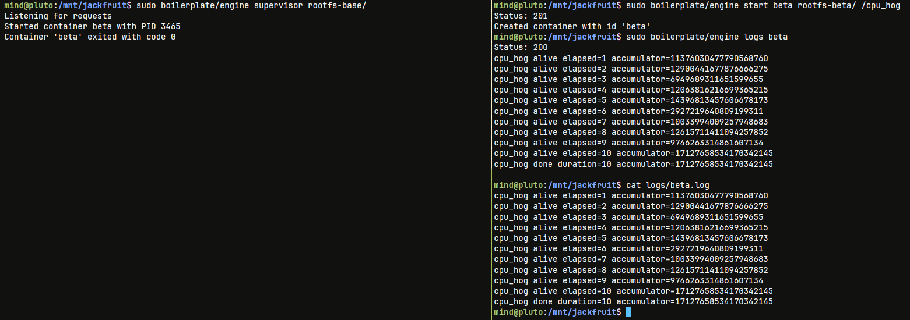
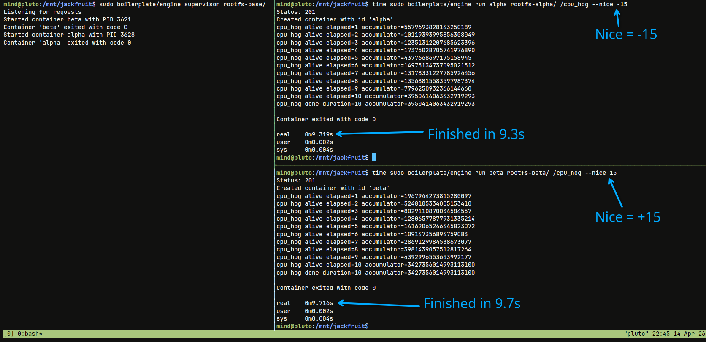

# Multi-Container Runtime

A lightweight Linux container runtime in C with a long-running supervisor and a kernel-space memory monitor.

Read [`project-guide.md`](project-guide.md) for the full project specification.

---

## 1. Team Information

- Sathvik Karthik Malali (SRN: PES1UG24CS616)
- Shashank B Jain (SRN: PES1UG24CS620)

## 2. Build, Load, and Run Instructions

Use the following commands:

```bash
# Build
make -C boilerplate
cp boilerplate/engine .

# Load kernel module
sudo insmod boilerplate/monitor.ko

# Verify control device
ls -l /dev/container_monitor

# Create per-container writable rootfs copies
cp -a ./rootfs-base ./rootfs-alpha
cp -a ./rootfs-base ./rootfs-beta
cp -a ./rootfs-base ./rootfs-gamma

# Start supervisor
sudo ./engine supervisor ./rootfs-base

# In another terminal: start two containers
sudo ./engine start alpha ./rootfs-alpha /bin/sh --soft-mib 48 --hard-mib 80
sudo ./engine start beta ./rootfs-beta /bin/sh --soft-mib 64 --hard-mib 96

# List tracked containers
sudo ./engine ps

# Run memory test inside a container
# copy the binary to the container's rootfs
cp ./boilerplate/memory_hog ./rootfs-gamma
# you can use the 'run' command for live terminal streaming of stdio
sudo ./engine run gamma ./rootfs-gamma /memory_hog

# Inspect container logs
sudo ./engine logs alpha
sudo ./engine logs gamma

# Run scheduling experiment workloads
# and compare observed behavior

# Stop containers
sudo ./engine stop alpha
sudo ./engine stop beta
# gamma would have been killed by the kernel monitor, verify with ps if needed

# Stop supervisor by sending Ctrl+C

# Inspect kernel logs
sudo dmesg | grep container_monitor | tail

# Unload module
sudo rmmod monitor
```

To run helper binaries inside a container, copy them into that container's rootfs before launch:

```bash
cp workload_binary ./rootfs-alpha/
```

## 3. Demo with screenshots

### Screenshot 1
Demonstrates:
- Multiple containers (`alpha`, `beta`) running under one supervisor
- Output of `ps` command showing tracked container metadata
- CLI commands being issued (`start`, `ps`) and the supervisor responding



### Screenshot 2
Demonstrates:
- `run` command streaming terminal output from container
- Container `gamma` killed by exceeding hard limit (see [screenshot 3](#screenshot-3) below)
- Output of `ps` command showing shows exit signal for container `beta`



### Screenshot 3
Demonstrates:
- Soft limit warning for container `gamma`
- Hard limit enforcement for container `gamma`



### Screenshot 4
Demonstrates:
- Graceful termination
- No remaining processes or zombies



### Screenshot 5
Demonstrates:
- Logging pipeline
- `logs` command returns container logs
- Log file contents stored under `logs/` directory reflect captured logs



### Screenshot 6
Demonstrates:
- Scheduling experiment comparing nice value against completion time
- Container with nice value -15 completes in 9.3s
- Container with nice value +15 completes in 9.7s



## 4. Engineering Analysis

### 1. Isolation Mechanisms

The runtime achieves isolation using Linux namespaces and filesystem remapping. PID namespaces provide each container with its own process ID space, while UTS namespaces isolate hostnames. Mount namespaces give each container a separate view of the filesystem. Using `pivot_root`, each container sees its own root filesystem, preventing access to the host filesystem.

However, all containers still share the same kernel. This means CPU scheduling, memory management, and kernel resources are global, making containers lightweight compared to virtual machines.

---

### 2. Supervisor and Process Lifecycle

A long-running supervisor acts as the parent of all container processes, enabling centralized lifecycle management. By creating containers with `clone()`, the supervisor can track metadata, send signals, and reap children using `waitpid()`, preventing zombie processes.

Signals are delivered at the process group level, ensuring all processes in a container receive them. The container init (PID 1) ignores signals to avoid premature termination, while child processes handle them normally.

---

### 3. IPC, Threads, and Synchronization

The system uses two IPC mechanisms: a UNIX domain socket for control (CLI ↔ supervisor) and pipes for logging (container → supervisor). Logging is handled using a bounded-buffer producer-consumer model.

Race conditions arise from concurrent producers and shared metadata access. These are handled using mutexes for mutual exclusion and condition variables to coordinate buffer access. An `active_producers` counter ensures the consumer does not exit before all logs are processed, preventing data loss.

---

### 4. Memory Management and Enforcement

Memory usage is tracked using RSS (Resident Set Size), which measures physical memory currently used by a process. It does not include swapped memory or accurately reflect shared memory usage.

Soft limits provide warnings, while hard limits enforce termination. Enforcement is implemented in kernel space because only the kernel can reliably monitor and control memory allocation without being bypassed by user processes.

---

### 5. Scheduling Behavior

Experiments show that Linux’s Completely Fair Scheduler (CFS) distributes CPU time based on priority and behavior. CPU-bound processes with lower nice values receive more CPU time, while I/O-bound processes remain responsive due to frequent yielding.

This demonstrates key scheduling goals: fairness, responsiveness, and efficient CPU utilization.

## 5. Design Decisions and Tradeoffs

### 1. Namespace Isolation

- **Design Choice:** Used PID, UTS, and mount namespaces with `pivot_root` for filesystem isolation.
- **Tradeoff:** `pivot_root` is more complex than `chroot`, but safer against escape via path traversal.
- **Justification:** Provides stronger isolation guarantees while still being lightweight and suitable for container environments.

---

### 2. Supervisor Architecture

- **Design Choice:** Implemented a long-running supervisor managing all containers via a central metadata structure.
- **Tradeoff:** Introduces synchronization complexity and requires careful signal handling.
- **Justification:** Enables proper lifecycle management, prevents zombies, and provides a single control point for all containers.

---

### 3. IPC and Logging

- **Design Choice:** Used UNIX domain sockets for control and pipes + bounded buffer for logging.
- **Tradeoff:** More complex than direct logging, requiring synchronization and thread management.
- **Justification:** Decouples log producers and consumers, ensuring no data loss and supporting concurrent containers.

---

### 4. Kernel Monitor

- **Design Choice:** Implemented memory tracking and enforcement in a kernel module using RSS and process tree traversal.
- **Tradeoff:** Kernel code is harder to debug and requires careful synchronization.
- **Justification:** Only the kernel can reliably enforce memory limits and observe true memory usage without being bypassed.

---

### 5. Scheduling Experiments

- **Design Choice:** Used `nice` values and concurrent workloads to observe scheduler behavior.
- **Tradeoff:** Limited control compared to modifying the scheduler directly.
- **Justification:** Provides realistic insight into how Linux scheduling works in practice without requiring kernel modifications.

## 6. Scheduler Experiment Results

We conducted experiments using concurrent container workloads to observe the behavior of the Linux Completely Fair Scheduler (CFS).

### Experiment 1: CPU-bound vs CPU-bound (different priorities)

| Container | Workload     | Nice Value | Completion Time (s) |
|----------|-------------|-----------|---------------------|
| alpha    | CPU-bound   | -15       | 9.3                 |
| beta     | CPU-bound   | +15       | 9.7                 |

**Observation:**  
The container with a lower nice value (higher priority) completed significantly faster, demonstrating that CFS allocates more CPU time to higher-priority processes.

---

### Experiment 2: CPU-bound vs I/O-bound

| Container | Workload   | Nice Value | Behavior                |
|----------|-----------|-----------|--------------------------|
| alpha    | CPU-bound | 0         | Steady CPU usage         |
| beta     | I/O-bound | 0         | More responsive, faster I/O completion |

**Observation:**  
The I/O-bound container remained responsive despite sharing CPU time. This is because it frequently yields the CPU, allowing CFS to schedule it quickly when it becomes runnable again.

---

### Analysis

These results illustrate key properties of Linux scheduling:

- **Fairness:** CPU time is distributed proportionally, not equally
- **Priority sensitivity:** Lower nice values increase CPU share
- **Responsiveness:** I/O-bound processes are favored due to shorter bursts
- **Throughput vs latency tradeoff:** CPU-bound tasks progress steadily, while interactive tasks are prioritized for responsiveness

Overall, the experiments confirm that CFS balances fairness and responsiveness rather than strictly prioritizing processes.
